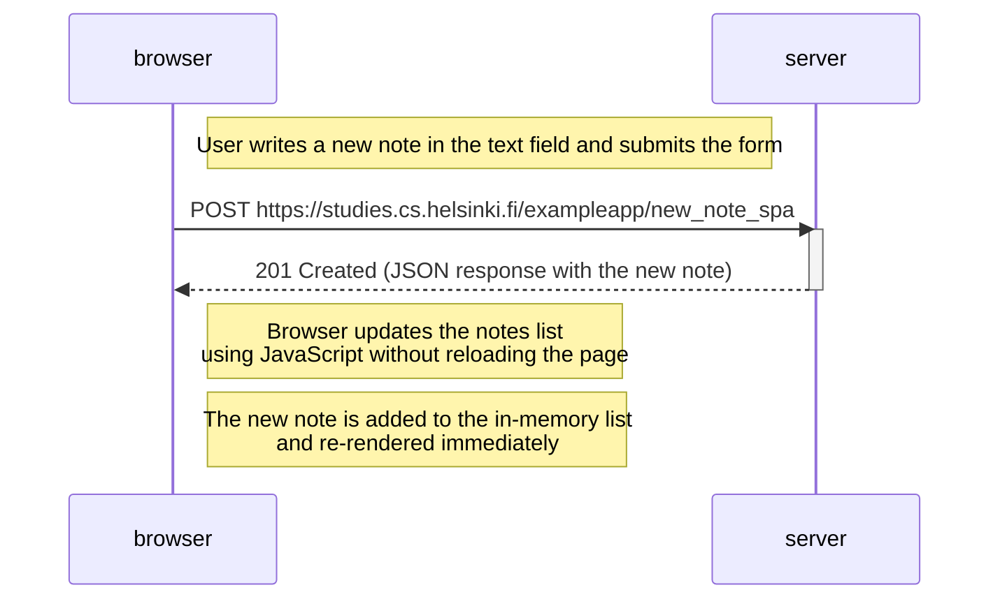

# Exercise 0.6 - New note in SPA diagram

```mermaid
sequenceDiagram
    participant browser
    participant server

    Note right of browser: User writes a new note in the text field and submits the form

    browser->>server: POST https://studies.cs.helsinki.fi/exampleapp/new_note_spa
    activate server
    server-->>browser: 201 Created (JSON response with the new note)
    deactivate server

    Note right of browser: Browser updates the notes list <br> using JavaScript without reloading the page

    Note right of browser: The new note is added to the in-memory list <br> and re-rendered immediately
```